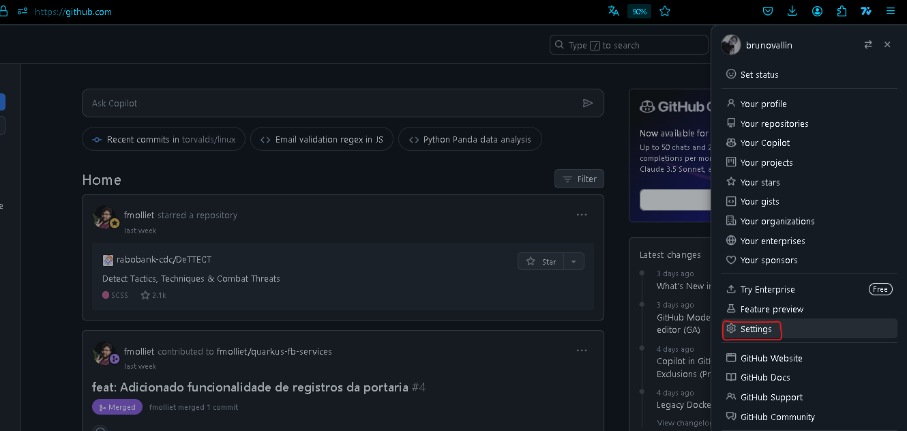
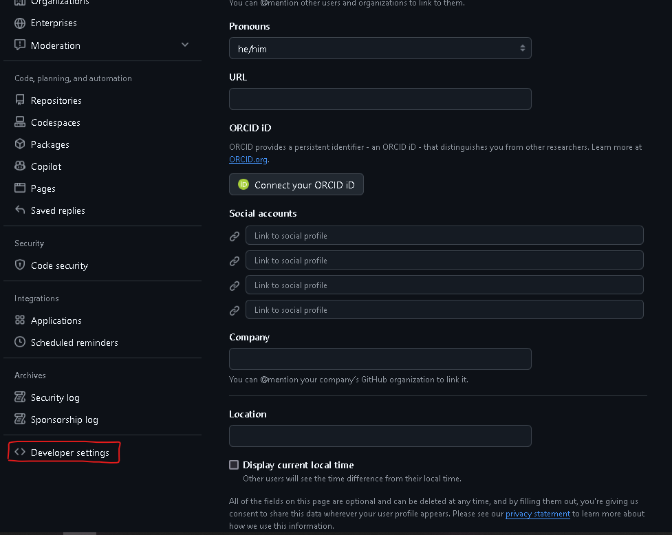
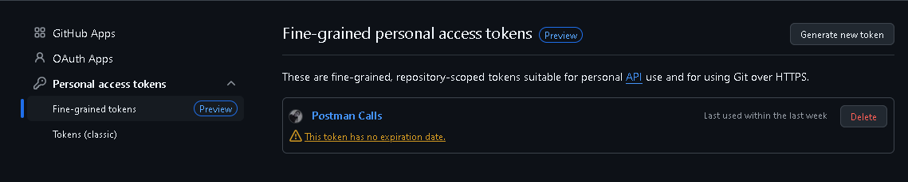
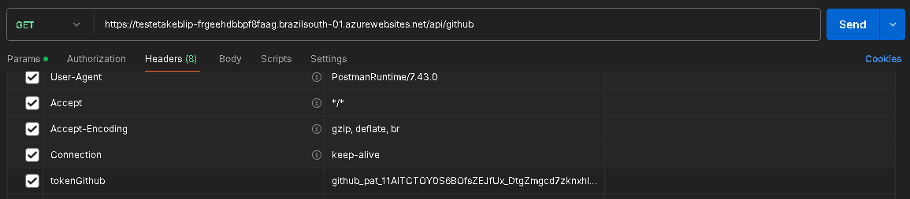

# TesteTakeBlip

O projeto abaixo tem como objetivo testar os conhecimento com um desafio proposto pela Blip.

## Hospedagem da API

A API foi hospedada em nuvem Azure.

Deixarei o [Link](https://testetakeblip-frgeehdbbpf8faag.brazilsouth-01.azurewebsites.net/api/github) para eventuais consultas e o serviço rodando.

## Pontos de atenção

É necessário um token do github para que a api possa retornar os valoress corretamente.

### Gerando token

Em Configurações:

Opções de desenvolvedor:

Token de acesso pessoal:

Não é recomendado utilizar um token sem data de expiração, não repetir o exemplo usado.

O token é enviado na requisição no header:

